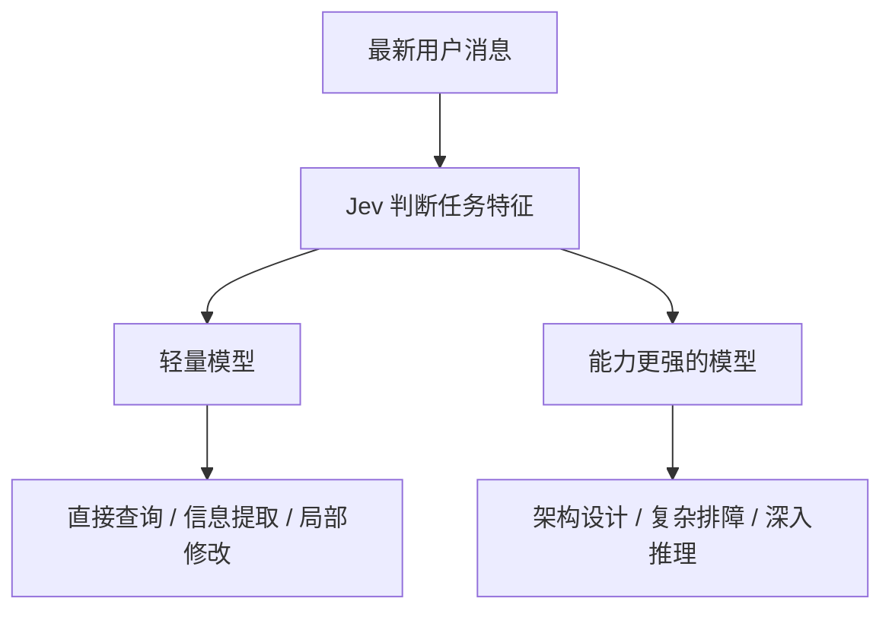
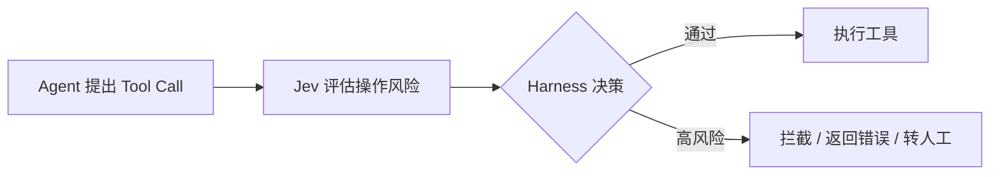
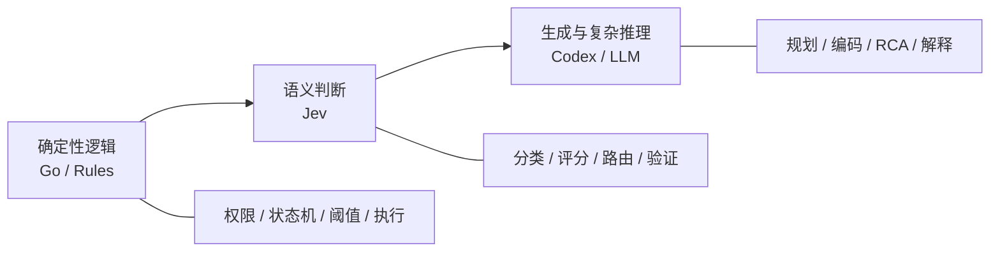

# 把 Agent 的小判断，交给 Jev

> **《Building a Harness with Jev》中文导读**  
> 原作者：Sydney Runkle · Hunter Lovell · 2026-09-17  
> 中文整理：2026-09-19

从一条工单到一次工具调用，看看专用判断模型怎样参与 Agent 的日常工作。

---

## 01｜每一轮执行，都有小判断

Agent 工作时，需要反复决定下一步：调用什么工具、怎样处理结果、任务是否还要继续。

文章提出，把其中**答案范围明确的判断交给 Jev**，复杂推理和内容生成继续由主模型完成。两个典型接入点是：

- **运行开始时选择模型**
- **工具执行前检查风险**

这里的 Harness，可以理解为让 Agent 运转起来的程序：它组织模型调用、工具执行和流程控制。Jev 的判断结果进入 Harness，成为下一步操作的依据。

TypeSafe 把 Jev 归为 **System One 模型**。它理解自然语言，主要返回开发者事先定义的**选项、等级和概率**。

> 原文引用厂商分类任务测试，提到最高约 200 倍速度、400 倍成本优势。这些数字来自特定测试条件，实际项目仍需要自己测量。

---

## 02｜Jev 的三种判断

假设值班群收到：

> “刚才发布后，部分用户无法登录，已经收到多条反馈，麻烦尽快排查。”

同一份上下文可以同时问几个独立问题：

| 类型 | 问题示例 | 输出示例 |
|---|---|---|
| **Choice** | 交给哪个团队？ | ops |
| **Score** | 影响有多严重？ | 1.7 / 2 |
| **Noul** | 是否需要立即处理？ | 0.97 |

- **Choice**：从给定类别中选择，同时返回各选项概率。
- **Score**：在预先定义的有序等级上评分。
- **Noul**：判断一个命题成立的概率。

Noul 返回 0.97，可以理解为模型给“需要立即处理”分配了 97% 的概率。衡量“严重到什么程度”则更适合用 Score。

---

## 03｜模型分流

LangChain 的 `ModelRouterMiddleware` 可以根据最新用户消息，在预设模型之间选择。



例如：

- “从发布记录里找出最近一个版本” → 轻量模型
- “分析多个服务之间的间歇性超时” → 更强模型

真正的模型选择标准，最好来自团队自己的历史任务和评测数据。

---

## 04｜工具执行前的风险检查

`AutoModeMiddleware` 可以在工具真正执行之前，用 Jev 判断操作风险和授权是否充分。



例如用户只是要求“查看故障日志”，Agent 却准备执行“删除备份”，可以把**操作是否超出用户请求范围**作为一个语义检查条件。

工程上更合理的分工是：

- RBAC / 权限系统判断：**有没有权限**
- Jev 判断：**这次做这个操作是否符合当前任务**
- Sandbox / Runtime 控制：**真正允许执行到什么范围**

---

## 05｜一个最小调用示例

```bash
pip install langchain-typesafe
export TYPESAFE_API_KEY="你的密钥"
```

```python
import os
from langchain_typesafe import Noul, TypeSafeClassifier

classifier = TypeSafeClassifier(
    questions={
        "urgent": Noul(
            instructions="这条消息是否需要立即处理？"
        )
    }
)

result = classifier.invoke(
    "部分用户无法登录，已有多条反馈，请尽快排查。"
)

print(result.nouls["urgent"].noul)
```

Jev 可以作为一个很小的判断组件嵌进现有节点或中间件，不需要把整个 Agent 重写。

---

## 06｜落地时，分工要清楚

### 1. 代码管理硬约束，模型处理语义

权限、数值计算、时间比较、状态机等适合由代码负责。Jev 更适合处理“这段内容属于什么类别”“这次操作是否符合当前意图”这类语义问题。

### 2. 留下“证据不足”的出口

Choice 里可以加入：

- 其他
- 无法判断
- 需要更多信息
- 需要人工复核

不要迫使模型一定从几个不合适的答案中选择一个。

### 3. 用自己的任务确定门槛

不要直接把某个概率值当作生产环境的安全线。建议先旁路运行，统计：

- 漏检率
- 误报率
- 延迟
- Token / API 成本
- 升级到强模型或人工的比例

再决定哪些低风险环节适合自动化。

---

## 对我们的 Agent / AIOps 项目的启发

可以把系统拆成三层：



对我们最值得尝试的几个位置：

1. **Model / Agent Routing**：选择 Codex、专业 Agent 或不同成本的模型。
2. **Tool Guardrail**：Runtime / MCP 工具执行前做语义风险检查。
3. **Agent Verification**：Codex 完成任务后，检查需求、证据和验收项是否对应。
4. **AIOps Semantic Filter**：从大量日志、告警和 Event 中筛出值得主模型进一步分析的信息。

> **一句话带走：频繁、答案明确的小判断交给 Jev；复杂推理和生成交给主模型；真正的执行边界仍由代码控制。**

---

## 原文与参考资料

- [Building a Harness with Jev](https://www.langchain.com/blog/building-a-harness-with-jev) — LangChain
- [LangChain · TypeSafe integrations](https://docs.langchain.com/oss/python/integrations/providers/typesafe)
- [TypeSafe · System One](https://docs.typesafe.ai/concepts/system-one)
- [TypeSafe · Choice](https://docs.typesafe.ai/primitives/choice)
- [TypeSafe · Score](https://docs.typesafe.ai/primitives/score)
- [TypeSafe · Noul](https://docs.typesafe.ai/primitives/noul)
- [TypeSafe · Confidence](https://docs.typesafe.ai/confidence)
- [Jev 1.13 · 已知限制](https://docs.typesafe.ai/model-jaggedness/jev-1.13)

---

*本页是原文的中文摘要与补充解读，不是全文逐字翻译。图示为重新整理的示意图。*
